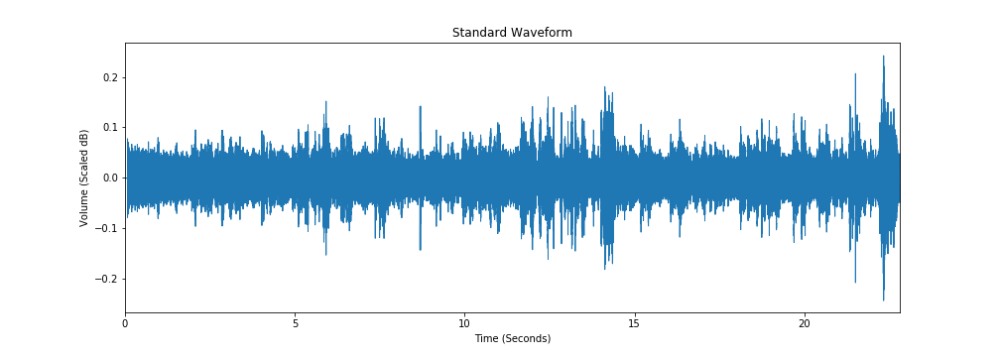
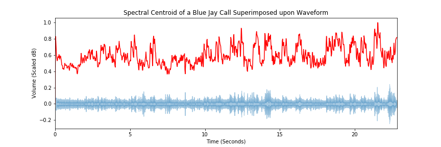
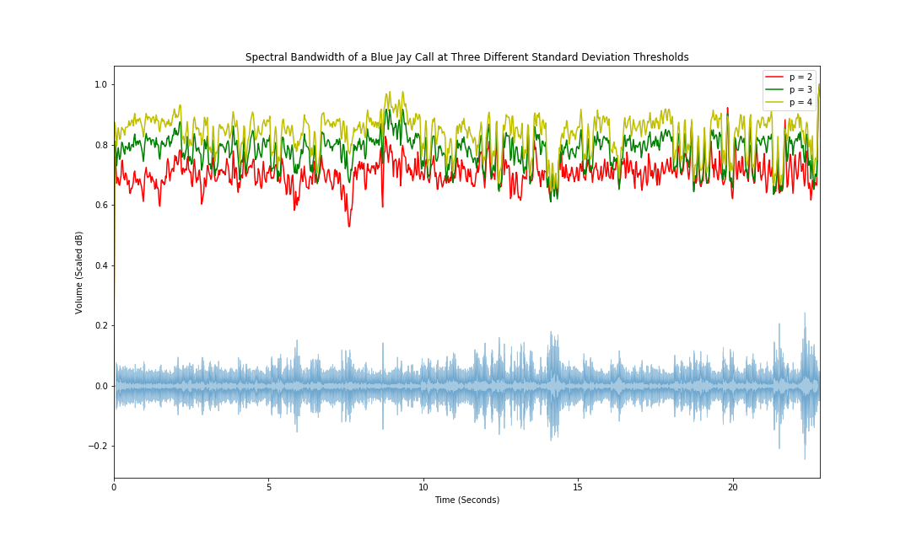
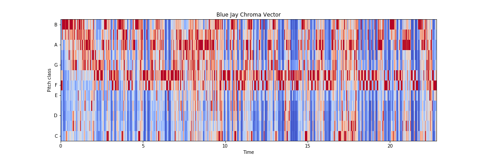
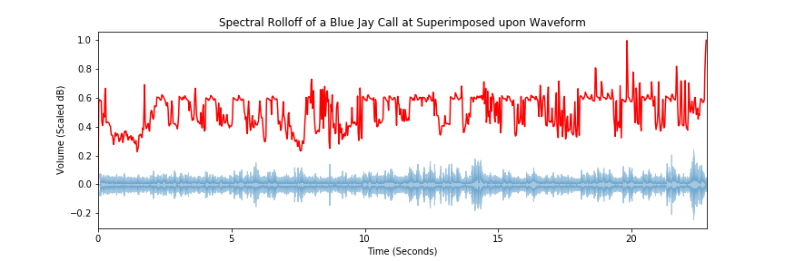
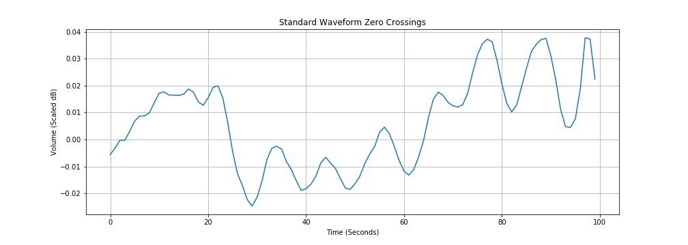
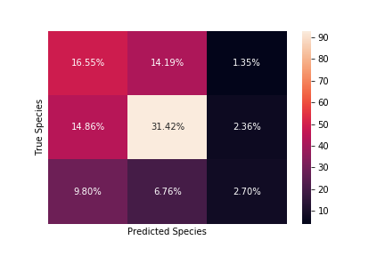

# Bird Bible: Bird Call Classification
### Authors: Ben Spilsbury

## Overview

The data science team investigates how to create a model to correctly identify bird species by audio recordings of their respective calls. For MVP analysis, only three bird species are considered in the data set. Three models are produced; these are a simple decision tree, a random forest, and a support-vector machine (SVM) model. Finally, an ensemble model of the random forest and SVM models are produced. The hard-voting ensemble of random forest and SVM models performs the best with an F1-score of ~0.49, but there exists much room for improvement. The key focus for next steps and model betterment is integrity of the training data set.


## Business Problem

The hobby: birding. Over 18 million Americans participate in the activity, trekking  out to the wilderness in order to hear, see, and identify any birds they may happen upon. One of the greatest barriers to entry in birding, however, is the generally high degree of orinthological knowledge required for species identification; there exist many handbooks with pictures and descriptions of calls to aid hobbyists, but finding the necessary information in a short amount of time is often burdensome and taxing- by the time a birder leafs through the handbook to find the right page of the suspected species, the bird has already flown off, never to be seen again. And the birder is left wondering which bird he or she actually happened upon.

The solution: BirdBible. It is a model that allows users to record actual bird calls in real time and, with this recording, identifies the encountered species. The model is based on over 1,000 recordings of bird species' calls and decomposes calls into salient audio characteristics that enable species classification.

## Data

Online repository xeno-canto is used to extract over 1,000 bird call recordings of cardinals, blue jays, and gold finches. These recordings are in .wav format.

## Method


### Feature Engineering

Six frequency and volume output features are engineered to serve as the basis for the resulting models.

#### Root Mean Squared

The energy root mean square of the audio recordings is a general gauge of energy (or in this case, volume) output of each recording. The easiest way of seeing such information is by viewing the standard waveform of .wav files, plotting decibel output over time. For analysis purposes, this information is averaged over the length of each recording. 



#### Spectral Centroid

Another gauge of pitch essentially, the spectral centroid of a recording finds the average frequency of a recording at a given point in time. However, this average frequency is weighted according to volume output. Altogether then, this gauge essentially calculates a sort of center of mass, in terms of frequency, for the bird calls.



#### Spectral Bandwidth

Spectral bandwidth measures, for a given point in a recording's time, the range of frequencies that are above a certain standard deviation threshhold of energy output. In other words, this essentially gauges a bird's instantaneous vocal range within a call and can help qualify the bird's tonal quality or character.



#### Chroma Vector

Related to the overall energy output of a recording, the chroma vector categorizes a recording's energy output by pitch. In other words, it classifies over time how much of a recording's wave amplitude can be attributed to a given tone.



#### Spectral Rolloff

Spectral rolloff is related to bandwidth. However, as opposed to indexing the magnitude of the frequency range within which a recording exists, it records the upper bound of that range. In this way, this feature generally measures how high the bird's call is.



#### Zero Crossing Rate

Zero crossing rate is another gauge to help analyze the tonal quality of a given bird's voice, specifically smoothness. In short, it measures the rate at which a recording's waveform oscillates from positive to negative decibel values.



### Models

To develop models, train and test sets of the data were produced, using the above six audio characteristics as features and the bird species as a target. For each model type, three iterations of grid searches were performed to fine tune hyperparameters. Resultant models were then evaluated according to F1-score, as class imbalance was present in the data (the cardinal majority class accounted for over 45% of the data set). Three different types of models were created- a benchmark decision tree, a random forest, and a support-vector machine. Lastly, the random forest and support-vector machine were combined in an ensemble in an attempt to improve model performance.

### Evaluation

The hard-voting ensemble of random forest and SVM models performs best with an F1-score of ~0.49. However, this F1-score leaves much room for improvement. As can be seen in the below confusion matrix, the correct class for bird calls was predicted 50.34% of the time, which is not ideal, considering the percent share of the cardinal majority class is close to 50% in the first place.

The model performed the best when predicting the majority species class, as one might expect, with 64.5% of its "cardinal" classifications being true. However, the model did poorly in predicting the other minority classes, with 51.6% and 14.0% of its "blue jay" and "gold finch" classifications being true, respectively.



## Conclusions

Overall the team finds that the hard-voting ensemble of random forest and SVM models performs best, with an F1-score of ~0.49. However, this indicative of relatively poor performance, seeing as the percent share of the majority class species is around 0.49, so a blind, majority-class-predicting model could theoretically perform on par.

The reason for poor performance is surmised to be overall integrity of sample recordings, as recognized during EDA. Standard devaitions of rolloffs and spectral centroids differed by around 15% and 10% between species, respectively. As these birds are all similarly sized, these differences should not be as high.

To eliminate these differences, the team needs to cull the sampled recordings to a fewer amount of more representative audio files. Ideally, these recordings should limit extra white noise and should contain purely the target bird's call.

## Navigation
```
├── audio_data
│   ├── BlueJayCalls
│   ├── CardinalCalls
│   └── FinchCalls
├── img_data
├── BirdBible.ipynb
├── BirdBibleNotebookPDF.pdf
├── BirdBiblePresentation.pdf
└── README.md

